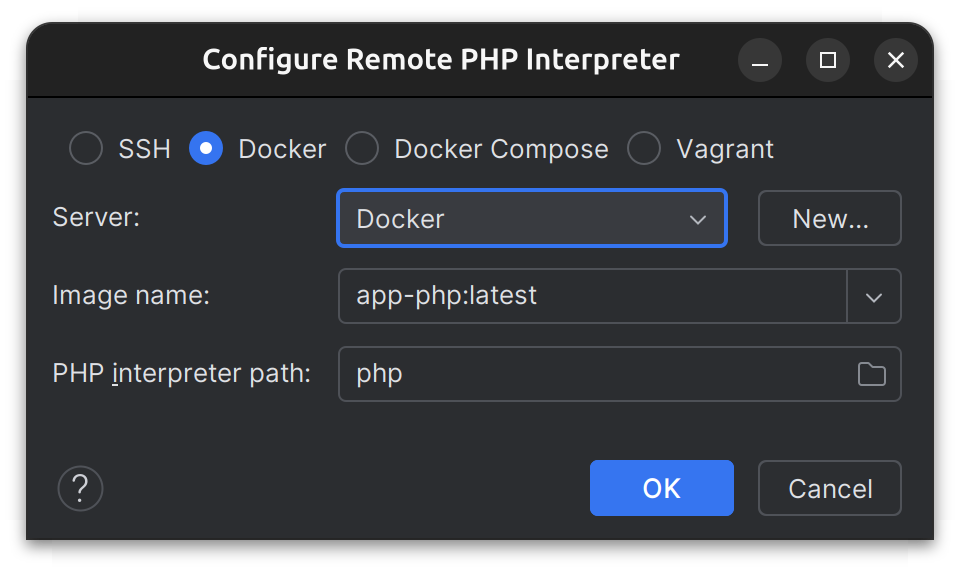
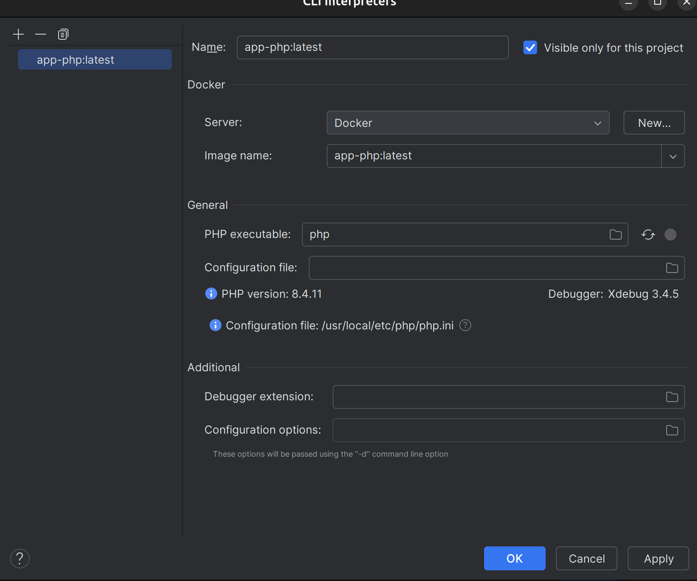

# Using Xdebug

## PHP Interpreter


Go to Settings | PHP and click on the ... next to CLI Interpreter.

Then configure the remote PHP interpreter as below and validate:


You should see your PHP version and its config file appear:


## Path mapping

Click on the directory in Docker Container and create a volume between the Phoenix root and /application.


1. In the `Settings/Preferences` dialog, go to `PHP | Servers`
2. Create a new server:
   * Name: `symfony` (or whatever you want to use for the variable `PHP_IDE_CONFIG`)
   * Host: `localhost` (or the one defined using the `SERVER_NAME` environment variable)
   * Port: `443`
   * Debugger: `Xdebug`
   * Check `Use path mappings`
   * Absolute path on the server: `/app`
You can now use the debugger!

1. In PHPStorm, open the `Run` menu and click on `Start Listening for PHP Debug Connections`
2. Add the `XDEBUG_SESSION=PHPSTORM` query parameter to the URL of the page you want to debug, or use [other available triggers](https://xdebug.org/docs/step_debug#activate_debugger)

    Alternatively, you can use [the **Xdebug extension**](https://xdebug.org/docs/step_debug#browser-extensions) for your preferred web browser. 

3. On command line, we might need to tell PHPStorm which [path mapping configuration](https://www.jetbrains.com/help/phpstorm/zero-configuration-debugging-cli.html#configure-path-mappings) should be used, set the value of the PHP_IDE_CONFIG environment variable to `serverName=symfony`, where `symfony` is the name of the debug server configured higher.

    Example:

    ```console
    XDEBUG_SESSION=1 PHP_IDE_CONFIG="serverName=symfony" php bin/console ...
    ```
