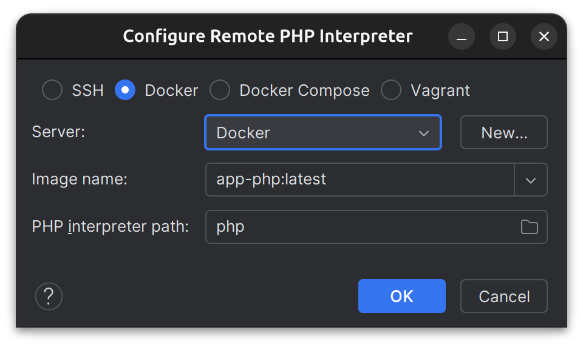
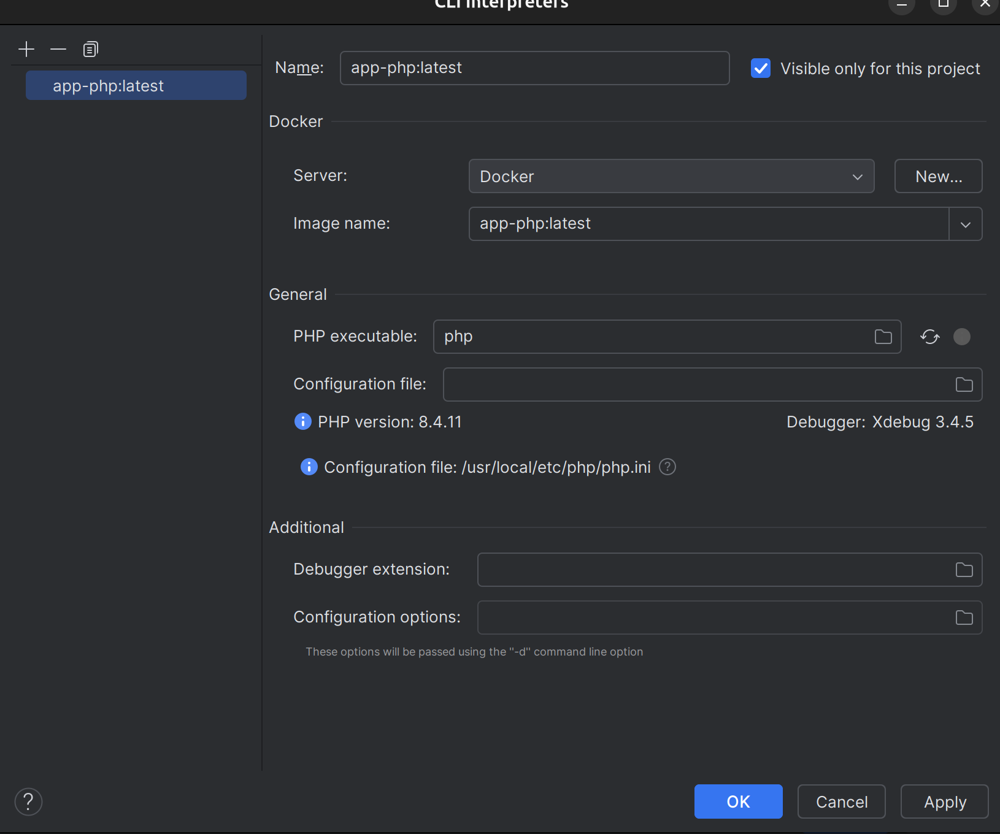

# Débogage avec XDebug

## Configurer l'interpréteur PHP (PHPStorm)

Aller dans `Settings | PHP` et cliquer sur `...` à côté de **CLI Interpreter**.

Configurer l'interpréteur PHP distant comme ci-dessous et valider :


La version PHP et son fichier de configuration doivent apparaître :


## Path mapping

Cliquer sur le répertoire dans **Docker Container** et créer un volume entre la racine du projet et `/app`.

1. Dans `Settings/Preferences`, aller dans `PHP | Servers`
2. Créer un nouveau serveur :
   - **Name** : `symfony` (ou la valeur de `PHP_IDE_CONFIG`)
   - **Host** : `localhost`
   - **Port** : `443`
   - **Debugger** : `Xdebug`
   - Cocher **Use path mappings**
   - Chemin absolu sur le serveur : `/app`

## Utiliser le débogueur

1. Dans PHPStorm, ouvrir le menu `Run` → **Start Listening for PHP Debug Connections**
2. Ajouter le paramètre `XDEBUG_SESSION=PHPSTORM` à l'URL, ou utiliser [l'extension navigateur XDebug](https://xdebug.org/docs/step_debug#browser-extensions)
3. En ligne de commande, préciser le serveur de débogage via `PHP_IDE_CONFIG` :

```bash
XDEBUG_SESSION=1 PHP_IDE_CONFIG="serverName=symfony" php bin/console ...
```

## Extension navigateur

[XDebug Helper for Firefox (JetBrains)](https://addons.mozilla.org/en-GB/firefox/addon/xdebug-helper-by-jetbrains/)
